```mermaid
%%{init: {'theme':'base','themeVariables':{
  'primaryColor':'#1f1a16',
  'primaryTextColor':'#d9c9a3',
  'primaryBorderColor':'#b88a3e',
  'lineColor':'#8a7d5e',
  'tertiaryColor':'#14110f',
  'background':'#14110f',
  'fontFamily':'ui-monospace, Courier New, monospace'
}}}%%
flowchart LR
    Start([START<br/>pick a pilot]):::start --> A1
    A1[ACT 1<br/><b>Road to the Foundry</b><br/>6 mooks · 2 elites]:::act1 --> A1B{Boss}:::pick
    A1B -.-> B1A[Foundry Tyrant<br/><i>steady pressure</i>]:::boss1
    A1B -.-> B1B[Salvage Colossus<br/><i>Strength snowball</i>]:::boss1
    A1B -.-> B1C[Reclaimer Prime<br/><i>Thorns retaliator</i>]:::boss1
    B1A --> A2
    B1B --> A2
    B1C --> A2
    A2[ACT 2<br/><b>The Foundry Depths</b><br/>5 mooks · 2 elites]:::act2 --> A2B{Boss}:::pick
    A2B -.-> B2A[Iron Sovereign<br/><i>charged volley</i>]:::boss2
    A2B -.-> B2B[Pyroclast Engine<br/><i>Burn pressure</i>]:::boss2
    A2B -.-> B2C[Vault Warden<br/><i>Slag pollution</i>]:::boss2
    B2A --> A3
    B2B --> A3
    B2C --> A3
    A3[ACT 3<br/><b>Above the Cloudline</b><br/>5 mooks · 2 elites]:::act3 --> A3B{Boss}:::pick
    A3B -.-> B3A[Stormheart<br/><i>lightning fortress</i>]:::boss3
    A3B -.-> B3B[The Wraith<br/><i>debuff + drain</i>]:::boss3
    A3B -.-> B3C[Cyclone King<br/><i>alternating stance</i>]:::boss3
    B3A --> Win
    B3B --> Win
    B3C --> Win([VICTORY]):::win

    classDef start fill:#1f1a16,stroke:#b88a3e,stroke-width:2px,color:#d9c9a3
    classDef act1  fill:#8a3b1f,stroke:#b88a3e,stroke-width:2px,color:#fff
    classDef act2  fill:#c44a2a,stroke:#b88a3e,stroke-width:2px,color:#fff
    classDef act3  fill:#4f7a9b,stroke:#b88a3e,stroke-width:2px,color:#fff
    classDef pick  fill:#2a2724,stroke:#d9ae4a,stroke-width:2px,color:#d9ae4a
    classDef boss1 fill:#2a2724,stroke:#8a3b1f,color:#d9c9a3
    classDef boss2 fill:#2a2724,stroke:#c44a2a,color:#d9c9a3
    classDef boss3 fill:#2a2724,stroke:#4f7a9b,color:#d9c9a3
    classDef win   fill:#6b9b4f,stroke:#d9c9a3,stroke-width:2px,color:#14110f
```

<div align="center">

<br>

# RUST &nbsp;&amp;&nbsp; RIVETS

### *A dieselpunk roguelike deckbuilder*

**Pilot a salvaged mech through three acts of rusting wasteland.**
**Forge a deck. Survive the foundry. Reach the cloudline.**

<br>

[](https://chrisdfennell.github.io/rust-and-rivets/)

<br>


<br>


&nbsp;

&nbsp;

&nbsp;

&nbsp;


<br>

</div>

---

## The Pitch

**Rust &amp; Rivets** is a single-player roguelike deckbuilder in the
lineage of *Slay the Spire* — reimagined with grease, soot, and brass.
Pick a pilot, board a battered war-mech, and chart your own route
through a procedurally-stitched map of combats, shops, rests, events,
and bosses. Beat the act-3 boss to win the run; die anywhere along
the way and the wasteland keeps your scrap.

There are **no asset files** for art or audio — every sprite is drawn
in code with `Phaser.Graphics`, and the soundtrack is generated live
by the Web Audio API. The whole thing fits in a folder and runs in
any modern browser.

> [!TIP]
> **Try it now →** [**chrisdfennell.github.io/rust-and-rivets**](https://chrisdfennell.github.io/rust-and-rivets/)
> &nbsp;·&nbsp; No install, no signup, save persists in `localStorage`.

---

## Features at a Glance

<table>
<tr>
<td valign="top" width="50%">

### Run Structure

- **3 acts** &nbsp;·&nbsp; **~20 nodes** each
- **9 bosses** total — each act picks 1 of 3
- **6 elites** &nbsp;·&nbsp; **10 regulars** across all acts
- **30 narrative events** with multi-choice outcomes
- **InterAct boons** between acts:

  
  
  

</td>
<td valign="top" width="50%">

### Deck &amp; Cards

- **~61 base** cards, each with a `+` upgrade
- **5 rarities**, border-tinted on every card:

  
  
  
  
  

- Keywords: *exhaust · retain · ethereal · innate · AoE · X-cost*
- **Status / curse cards** injected by enemies and events
- **4 powers**: Demon Form, Barricade, Metallicize, Combust

</td>
</tr>
<tr>
<td valign="top" width="50%">

### Mechs &amp; Meta

- **24 relics** with rich lifecycle hooks
  <br><sub>`onCombatStart` · `onTurnEnd` · `onCardPlayed` ...</sub>
- **8 potions** in a 3-slot belt (expandable)
- **Workshop meta-progression** — 8 upgrades, 18-point cap
- **Save / load** to `localStorage` after every mutation
- **Export / Import** via base64 bundle (run + meta)

</td>
<td valign="top" width="50%">

### Pure-Code Aesthetics

- **All sprites drawn in code** — no PNGs, no atlas
- **Procedural Web Audio** ambient + SFX — no asset files
- **Drag-to-target** combat &nbsp;·&nbsp; **aim mode** for potions
- **Animated idle tweens** on every enemy
- Stack: **Phaser 3** &nbsp;·&nbsp; **TypeScript 5** &nbsp;·&nbsp; **Vite**

</td>
</tr>
</table>

---

## Status Keywords

The same palette the game uses (`src/ui/theme.ts`) carries straight
into the cards, intents, and effect chips. **If you see a color, it
means something.**

| Status | What it does |
|---|---|
|  | Takes **+50%** damage while stacked |
|  | Deals **−25%** damage while stacked |
|  | End-of-turn hull tick |
|  | Retaliates on every hit taken |
|  | Shield, wipes at end of turn |
|  | **+1 damage** per stack |
|  | **+1 plating** per skill played |

---

## The Pilots

| Pilot | Hull | Signature Relic | Identity |
|---|---|---|---|
| **THE PILOT** |  | *none — clean slate* | Balanced operator. The standard rig — no surprises, no flaws. |
| **THE ENGINEER** |  |  | Layered armor, careful hands. Trades raw hull for plating. |
| **THE SABOTEUR** |  |  | Toxic. Fragile. Sharp. Begin every fight with the enemy already compromised. |
| **THE STOKER** |  |  | Set them alight. Reap the smoke. Burning enemies ramp Strength every turn. |

---

## The Run

Each act ends with a boss chosen from a pool of three — you don't
know which until you arrive. Decks that auto-pilot through one boss
get punished by another.



---

## Getting Started

> [!NOTE]
> Requires **Node 18+**. No native deps, no headless browser, no test
> framework — `npm run build` is the gate.

```bash
# Clone
git clone https://github.com/chrisdfennell/rust-and-rivets.git
cd rust-and-rivets

# Install (Phaser 3, TypeScript, Vite — that's it)
npm install

# Dev server — hot reload at http://localhost:5173
npm run dev

# Production build (type-checks first, then bundles to dist/)
npm run build

# Preview the prod build locally
npm run preview
```

---

## Project Layout

```text
src/
├── audio/         Procedural Web Audio — ambient music, SFX, mute persistence
├── game/          Pure game logic, no Phaser imports
│   ├── cards.ts        ~61 cards + `+` variants
│   ├── enemies.ts      19 enemies + 9 bosses + encounter pickers
│   ├── relics.ts       24 relics with lifecycle hooks
│   ├── potions.ts      8 potions
│   ├── powers.ts       Demon Form, Barricade, Metallicize, Combust
│   ├── events.ts       30 narrative events
│   ├── combat.ts       Turn loop, damage pipeline, statuses
│   ├── map.ts          Procedural node graph
│   ├── meta.ts         Workshop / persistent upgrades
│   ├── save.ts         localStorage + base64 export
│   └── types.ts        EnemyDef, CardDef, ResolveCtx, ...
├── scenes/        Phaser Scenes — Title, CharacterSelect, Map, Combat, ...
├── ui/            CardView, IntentBubble, MechSprite (all sprites here)
└── main.ts        Phaser bootstrap
```

The split between `src/game/` (pure logic) and `src/scenes/` + `src/ui/`
(Phaser presentation) is the project's central discipline. The game
logic is testable in isolation; the rendering layer is throwaway.

---

## Design Philosophy

> [!IMPORTANT]
> *"Every enemy intent should be readable in under a second. Every card
> decision should feel like it has a wrong answer."*

A few load-bearing rules:

- 
  &nbsp; **Intents show real damage.** The number under an enemy's
  icon is the damage you'll actually take this turn — post-Strength,
  post-Vulnerable, post-Weak. No mental math, no surprises.

- 
  &nbsp; **Bosses pick from a pool.** Each act has 3 bosses; you don't
  know which until you arrive. Decks that auto-pilot through one boss
  get punished by another.

- 
  &nbsp; **Pure procedural art.** No PNGs, no audio files. The cost of
  a new enemy is one function in `MechSprite.ts` and one entry in
  `enemies.ts`.

- 
  &nbsp; **Save constantly.** Every game-state mutation persists to
  `localStorage`. Refresh mid-fight, resume mid-fight. A bug should
  never cost a run.

The full development history — slice by slice, why each decision was
made — lives in **[DEVLOG.md](DEVLOG.md)**.

---

## Status


Four pilots. Nine bosses. Thirty events. Twenty-four relics. Balance
is being tuned in public; the [DEVLOG](DEVLOG.md) is the running record.

This is a solo personal project. Issues and PRs welcome but aren't
the development driver — the project ships on its own cadence.

---

<div align="center">

[](https://chrisdfennell.github.io/rust-and-rivets/)
&nbsp;
[](DEVLOG.md)
&nbsp;
[](https://github.com/chrisdfennell/rust-and-rivets)

<br>

<sub><i>Built with grease, soot, and brass.</i></sub>

</div>
